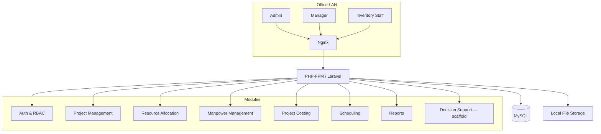

# Architecture & Design Patterns

Read this before starting any new module or restructuring existing code.

## Shape of the system

A **modular monolith** — one Laravel application, internally organized into
clear domain modules, deployed as a single unit. This is correct for this
system's scale (10–50 LAN users); don't reach for microservices or a
separate API layer to "future-proof" it. That's solving a problem this
system doesn't have.



## Request flow — follow this on every feature

```
Route → Controller (thin) → Form Request (validation)
      → Service class (business logic) → Eloquent Model (data access)
      → Blade view (presentation)
```

- **Controllers orchestrate, they don't compute.** If a controller method has
  an `if` statement deciding business logic (not just "did validation pass"),
  that logic belongs in a Service class instead.
- **One Service class per module**: `ProjectService`, `ResourceAllocationService`,
  `ManpowerService`, `CostingService`, `SchedulingService`. Business rules
  ("can this project move from Pending to Ongoing," "is there enough stock to
  allocate") live here.
- **Form Requests validate, controllers don't.** Every `store`/`update` action
  gets its own `App\Http\Requests\{Action}{Model}Request` class.

## Module map (mirrors the roles defined in the project's Chapter 1)

| Module | Responsibility | Primary role(s) |
|---|---|---|
| Auth & User Management | Login, roles, account management | Admin |
| Project Management | Registration, details, status (Completed/Ongoing/Pending), history | Admin, Manager |
| Resource Allocation | Material/tool/equipment availability and allocation | Manager, Inventory Staff |
| Manpower Management | Employee records, deployment matching | Manager |
| Project Costing | Budget breakdown, total cost computation | Admin |
| Scheduling | Duration estimation, deadline tracking | Admin |
| Reports | Printable/downloadable summaries | Admin, Manager |
| Analytical Dashboard | Overview of ongoing/completed/upcoming projects | Admin |
| Equipment Records | Tool/material condition tracking | Inventory Staff |
| Decision Support | **Scaffold only** — see `decision-support-guardrails.md` | Admin, Manager |

## Design patterns to use, and when

- **Service Layer** — always, per module. This is the default, not optional.
- **Repository pattern — use selectively, not by default.** Most CRUD-heavy
  modules don't need it; Eloquent models are enough. Reserve it for logic
  you'll want to swap/mock in tests — the Decision Support engine (once
  built, per `decision-support-guardrails.md`) is the clearest candidate.
- **DTOs** — for structured data crossing a layer boundary, especially the
  Decision Support input/output contract.
- **Strategy pattern** — the future Decision Support engine is designed
  around interchangeable strategy classes (manpower matching, material
  estimation, timeline estimation) behind one interface, so a new strategy
  can be added without rewriting the module. Don't build the strategies yet
  — just don't design the interface in a way that would require a rewrite
  to add them later.
- **Observer pattern** — model events/observers for side effects like
  auto-logging a status change, not for core business logic.
- **SOLID, applied practically:**
  - *Single Responsibility* — a controller method does one thing; a service
    method does one thing.
  - *Open/Closed* — new functionality extends existing classes/interfaces
    rather than modifying their internals where avoidable.
  - *Dependency Inversion* — inject services via Laravel's container rather
    than instantiating them inline inside a controller.

## Folder structure

```
app/
  Http/
    Controllers/
      ProjectController.php
      ResourceAllocationController.php
      ManpowerController.php
      CostingController.php
      SchedulingController.php
      ReportsController.php
      DecisionSupportController.php
    Requests/
      StoreProjectRequest.php
      ...
  Services/
    ProjectService.php
    ResourceAllocationService.php
    ManpowerService.php
    CostingService.php
    DecisionSupport/
      DecisionSupportService.php
      DTOs/DecisionSupportResult.php
      Strategies/            # not populated until decision-support-guardrails.md says go
  Models/
    Project.php
    Resource.php
    Employee.php
    ...
  Policies/
database/
  migrations/
  seeders/
resources/
  views/
    projects/
    resources/
    manpower/
    costing/
    decision-support/
    dashboard/
routes/
  web.php
tests/
  Feature/
  Unit/
```

Match this structure for any new module — new domain, new folder in each of
`Controllers/`, `Services/`, `Models/` (as needed), `views/`, and a
corresponding `Feature` test.
